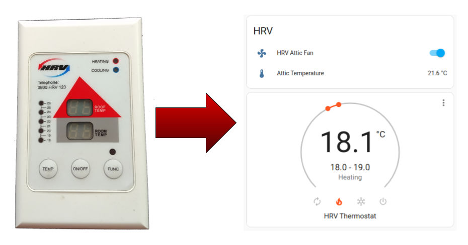
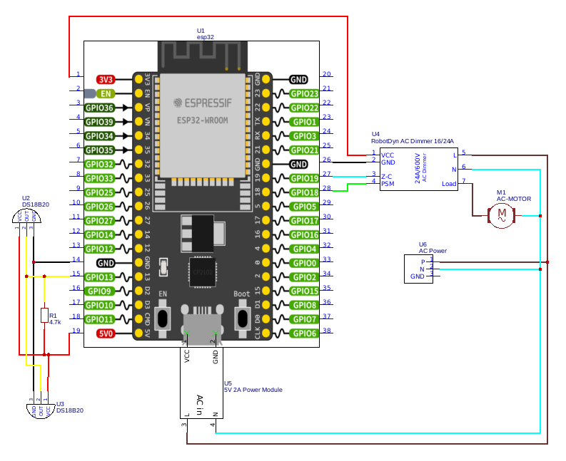
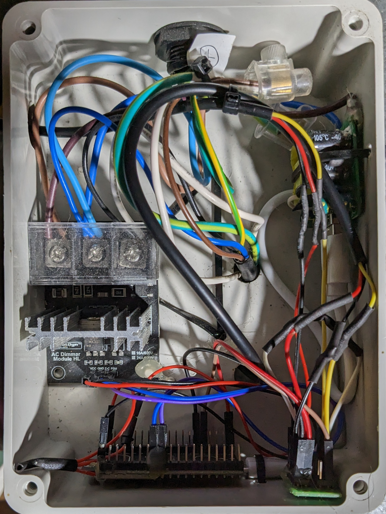

# HRV controller
This is a smart replacement for an HRV/ERV controller

The software will automatically switch between heating and cooling mode depending on the attic and house temperature comparison.

Setting the mode to 'off' will override the automatic mode setting. 

## Hardware
* [ESP32-WROOM-32D Microcontroller](https://s.click.aliexpress.com/e/_DnBZ0rd)
* [DS18B20 Temperature Sensor x2](https://s.click.aliexpress.com/e/_DlF2SIx)
* [RobotDyn Dimmer/Motor Controller module](https://s.click.aliexpress.com/e/_DlDin6n)
* [Mains to 5v DC adapter](https://s.click.aliexpress.com/e/_DBtTMj5)


## Installation

Install [ESPHome](https://esphome.io/guides/installing_esphome.html)

Create a ```secrets.yaml``` file and add your Wi-Fi credentials in this format

wifi_ssid: '<SSID>'
wifi_password: '<PASSWORD>'

Then run: ```esphome run hrv.yaml```

## Display


## Circuit Diagram


## Assembly


